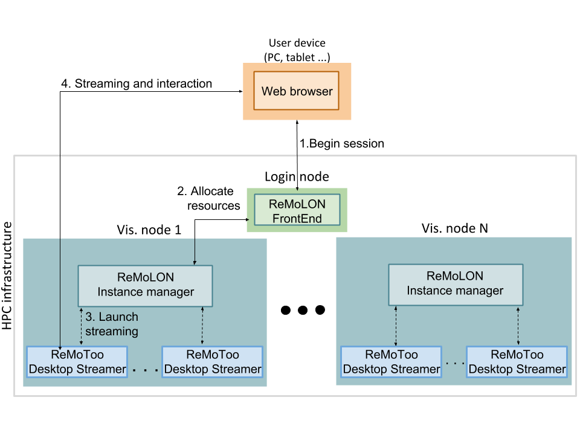

ReMoToo
=====================================================
## Introduction

ReMoToo is a system service that is able to stream the desktop to web remote
clients, making possible to have interactive sessions over remote high performance 
systems or even regular systems through a simple web browser. 

The high quality visualization and low latency are key aspects of this tool, 
to get that, ReMoToo uses video compression technology on the server side 
and then sends the generated video stream to the client in a transparent 
and easy way.

On the server side, several ReMoToo instances are managed by the ReMoLON system service. This
service is in charge of the initiation, control and stop of ReMoToo visualization
streamed to the final web clients.

The ReMoLON system service is connected through the ReMoLON_FrontEnd, a simple web
server running on the login node/s. This FrontEnd is in charge of the user 
authentication and configuration of the ReMoToo instances through the ReMoLON system services.

The next figure shows all this components and how they work to achieve 
the remote visualization:



## Dependencies
* Required dependencies:
    * [ReMo](https://github.com/HBPVIS/remo) (and it's dependencies, see the details on the official)
    * [ReMoLON](https://github.com/HBPVIS/remolon)
    * [WebStreamer](https://github.com/HBPVIS/webstreamer)

* Optional dependencies:
    * [libClipboard](https://github.com/jtanx/libclipboard): To have remote clipboard
    functionality (Copy/Cut/Paste) in the server but controlled from the web client.

## Building

ReMoToo has been successfully built and used on Ubuntu 18.04/Debian Strech Stable.
The following steps should be enough to build it just with the required dependencies.
ReMoToo (and ReMo) needs to be built with the WebStreamer dependency, and WebStreamer
needs to be compiled as shared library (setting the CMAKE variable BUILD_SHARED_LIBS
to ON). Then the WebStreamer build directory needs to be specified to ReMoToo at configuration
time using CMAKE_PREFIX_PATH variable.

## Description

```bash
git clone https://github.com/gmrvvis/ReMoToo.git
mkdir ReMoToo/build && cd ReMoToo/build
cmake .. [-DCMAKE_PREFIX_PATH=/path/to/webstreamer/buildDirectory]
make
```

## Configuration
There is one configuration file which must be edited to make ReMoToo work properly:

* sessionClientConfig.cfg: Located in the ReMoToo build directory. This file 
contains settings to configure the ip address and port where ReMoLON Frontend 
will be listening for connections.
